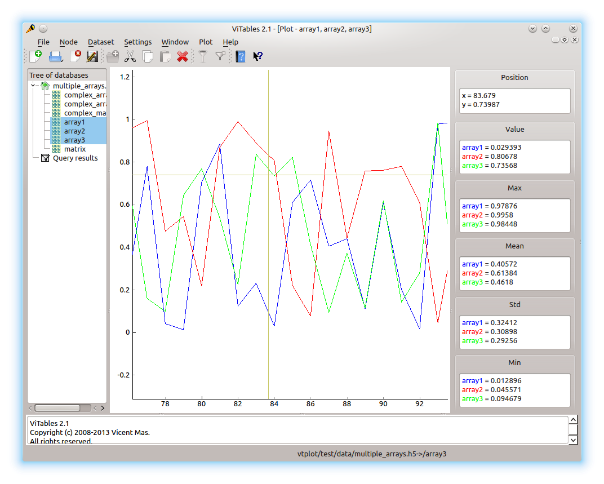
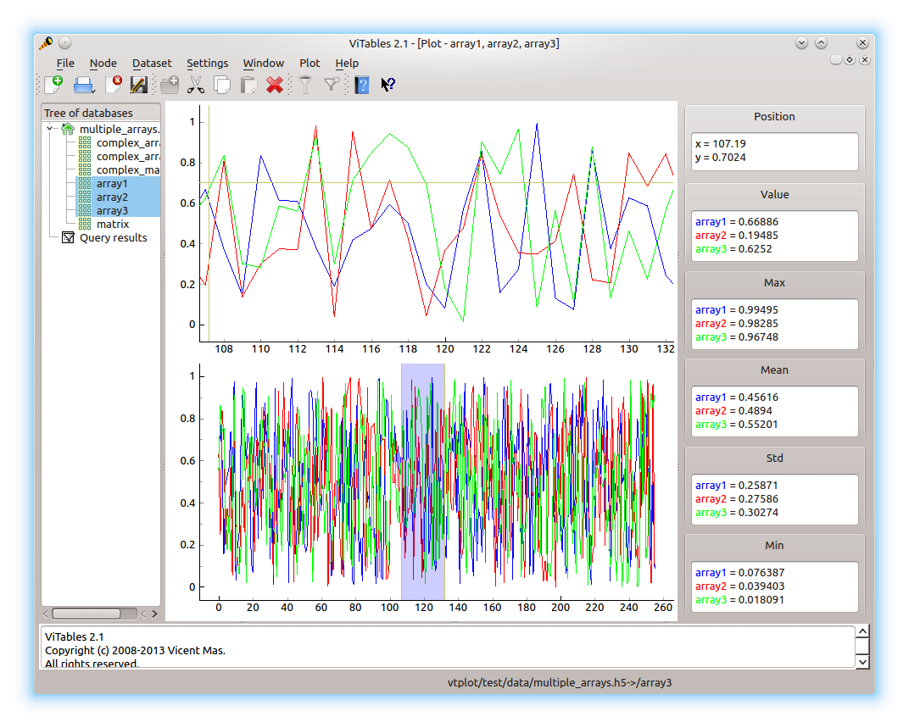
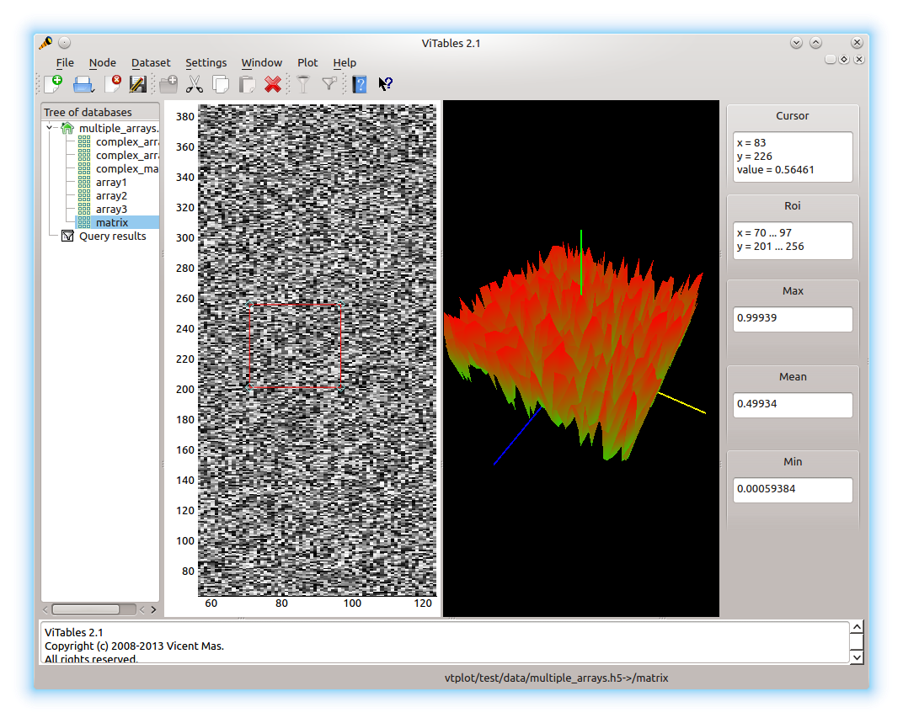

VTPlot
======

ViTables data plotting plugin.

## Screenshots ##

`Plot` menu entry displays selected datasets along with cursor
 position, dataset values at `x` cursor position and statistics of
 shown data.



`Dual plot` menu entry displays an overall view (bottom graph) and the
portion of data (top graph) selected on the overall view.



`Surf plot` shows heat map of data and 3D view of selected region of
interest




## Setting up development environment ##

1. Install `virtualenvwrapper` and create an environment

```sh
mkvirtualenv --python=python2.7 --system-site-packages vtplot
```
or start working in already created environment

```sh
workon vtplot
```

2. Install the following packages from pip if necessary: `numexpr`,
   `cython`, `tables`, `pyqtgraph`.

3. Clone and install `vitables` inside virtual environment.

4. Copy `VTPlot` into `vitables` plugin folder and run it:

```sh
cp -a vtplot ${VIRTUAL_ENV}/lib/python2.7/site-packages/vitables/plugins && ${VIRTUAL_ENV}/bin/vitables -vvv vtplot/test/data/array.h5
```

## TODO ##

* Implement nice plots of data sets with big difference in scale.
* Implement custom horizontal axis values.
* Step plot and events.
* Display selected matrix rows/columns.
* Display multiple graphs below each other.
* Store current settings in a configuration.
* Add settings for displayed statistical information.
* Allow choice between real, imag, abs, angle when plotting complex
  data.
* Plot matrix along with 2 slices.
* Improve surface plot look.
* Add selection between mesh and surface plot.
* Add displaying images along with some image related tools.
* Add plotting for series of images and 3d arrays.
